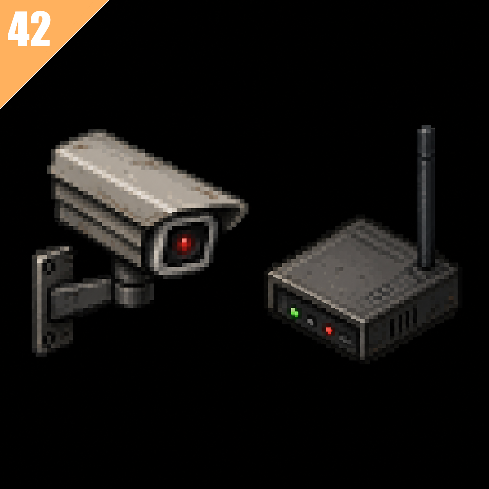

<p align="center">
  <a href="https://github.com/lenkors/PZ_mod_CCTV" target="_blank" rel="noopener noreferrer">
    
  </a>
</p>

<p align="center">
  <a href="https://github.com/lenkors/PZ_mod_CCTV/blob/main/mod.info"></a>
  <a href="https://projectzomboid.com/"></a>
  <a href="https://github.com/lenkors/PZ_mod_CCTV/blob/main/LICENSE"></a>
</p>

<h1 align="center">CCTV Base ALPHA</h1>

<p align="center">
  Мод для <b>Project Zomboid (Build 42)</b>, добавляющий простую систему видеонаблюдения:<br>
  камеры, ретрансляторы сигнала и просмотр эфира через телевизор.
</p>

---

## 📋 О моде

**CCTV Base** позволяет игроку устанавливать камеры видеонаблюдения и ретрансляторы сигнала прямо в мире, а затем подключаться к ним через обычный телевизор, чтобы удалённо наблюдать за территорией — как настоящая система CCTV на базе. Это основа (фундамент) для более крупной системы охраны/наблюдения, которую можно будет развивать дальше.

Сейчас мод находится в статусе **MVP (альфа)** — реализован базовый игровой цикл без учёта электропитания телевизора и работы игровой сети, это будет добавлено позже. Большую часть функционала подготовлю в версии 0.5.X, регистрация мода в steam будет с версии 0.2

## Установка и разработка
По умолчанию используем базовый Lua и к нему я очень советую поставить emmyLua и Umbrella. </br>
<a href="git@github.com:PZ-Umbrella/Umbrella.git">Установка Umbrella</a>, она ставиться скоре как пакет (конфиг уже настроен так что кладите ее в ```packages```), так же ей в компанию советую поставить emmyLua как расширение для VSC.
<p>
  Так же не возбраняется исползование <a href="https://github.com/asledgehammer/PipeWrench-Template">asledgehammer/PipeWrench-Template</a> Особенно если вы знаете js\ts то вам очень понравиться.</br>
  Скорее всего дальнейшая разработка мода будет через него. Инструкция и настройка фреймворка есть в его Readme самого репозитория PipeWrench-Template.
</p>

#### Если у вас другая IDE
То по установке читайте <a href="https://pz-umbrella.github.io/wiki/">тут</a>. 


## ✨ Возможности

- 📷 **Камера CCTV** — устанавливается из инвентаря на клетку игрока через контекстное меню.
- 📡 **Ретранслятор сигнала** — расширяет зону приёма, позволяя ловить камеры, находящиеся дальше базовой дистанции.
- 📺 **Подключение к телевизору** — в контекстном меню телевизора появляется пункт «Подключиться к CCTV», если поблизости есть доступные камеры.
- 🖥️ **Полноэкранный интерфейс просмотра** — переключение между камерами кнопками «Пред.» / «След.», отображение названия камеры, условного уровня сигнала и её порядкового номера.
- 📶 **Расчёт дальности сигнала** — камеры доступны в пределах базового радиуса или через ретранслятор в зоне действия.
- 🌐 **Локализация** — базовые строки интерфейса (EN/RU).

## 🛠 Установка для игры

1. Скачайте мод (через Steam Workshop (около-стабильная версия) или клонированием репозитория (тестовая версия из master ветки)).
2. Поместите папку мода в директорию `Zomboid/mods/`.
3. Включите **CCTV Base** в списке модов в меню игры (требуется Project Zomboid Build 42+). </br>
```P.S: Обновление ветки происходят чаще чем обновления в стиме! Так что если вам нужна САМАЯ последняя (возможно не стабильная версия) то берите из master```

## 🎮 Как использовать

1. Установите **CCTV камеру** в нужной точке карты (ПКМ по предмету в инвентаре → «Установить камеру CCTV»).
2. При необходимости расширить дальность — установите рядом **Ретранслятор сигнала**.
3. Подойдите к телевизору и выберите в контекстном меню **«Подключиться к CCTV»**.
4. Переключайтесь между доступными камерами кнопками на экране и следите за обстановкой.

## ⚠️ Известные ограничения MVP

- Не проверяется, включён ли телевизор и есть ли электричество в сети (приоритет верси 0.3).
- Не реализована работа через игровую сеть/связь как отдельный ресурс (приоритет верси 0.3).

## 🛣️ ROADMAP

- Поддержка работы мода на серверной части (для МП - MVP) (версия 0.5.0)
- Добавить switch системы для камер и их ограничения по версиям (TBD)
- Реализация работы ПК для просмотра камер (версия 0.4)
- Разновидности камер по углу обзора и потреблению ресурсов (версия 1.0).
- Добавление фильтров для камер (TBD)
- Добавление ночного режима для определенных камер (версия 0.5)
- ✅ ~~Добавление базового крафта камеры (версия 0.3)~~

Подробный список изменений — в [CHANGELOG.md](CHANGELOG.md).

## 📄 Лицензия

Проект распространяется под лицензией [GPL-3.0](LICENSE).
